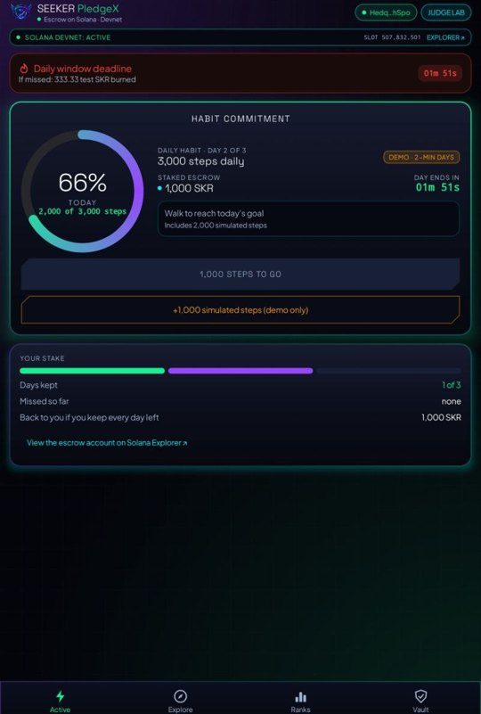
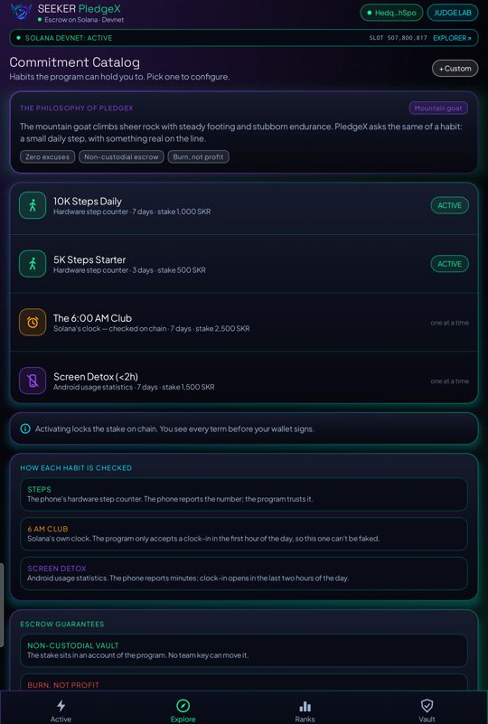
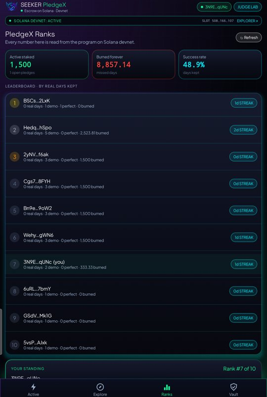
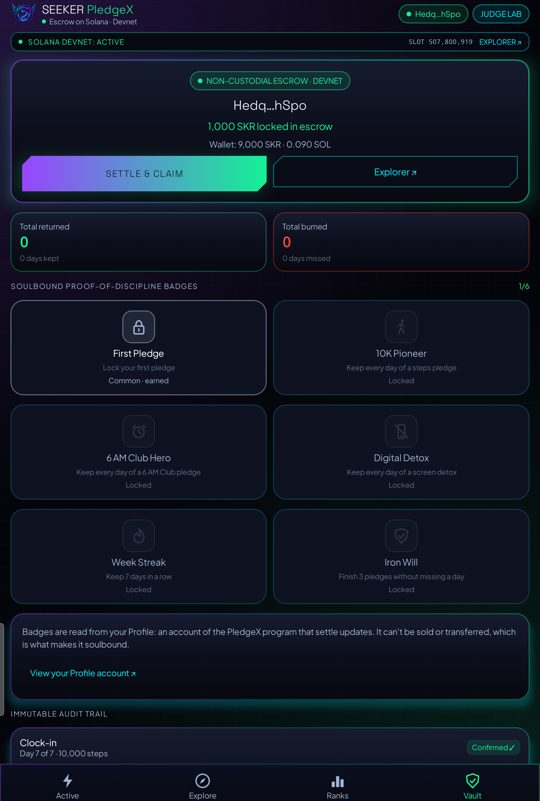

<p align="center"></p>

# PledgeX

[](https://github.com/FannBe/PledgeX/actions/workflows/build-apk.yml)
[](https://github.com/FannBe/PledgeX/actions/workflows/program.yml)
[](https://github.com/FannBe/PledgeX/actions/workflows/crank.yml)
[](https://github.com/FannBe/PledgeX/releases/latest)

**Stake on your daily habits. Keep the day, and it comes back. Miss it, and that day's stake burns.**

<p align="center">
  
  
  
  
</p>

PledgeX is an Android app and a Solana program. You lock test SKR for a number of days on a daily habit. Each day you keep it, you check in on chain. After the last day the program returns the days you kept and **burns** the days you missed. Nobody receives a missed stake, including the developers.

### Habits the program enforces

| Habit | How a day is checked | Check-in window (on Solana's clock) |
|---|---|---|
| **Steps** (3K–10K) | the phone's hardware step counter; the phone reports the count | any time in the day |
| **The 6:00 AM Club** | **Solana's clock alone**, so it cannot be faked | 05:00–06:00 local (the first hour of the day) |
| **Screen detox** (< 1–3 h) | Android usage statistics; the phone reports the minutes | 22:00–24:00 (the last two hours of the day) |

### In the app

- **Active**: today's ring, the daily deadline, and a one-tap check-in signed by the phone's session key (no wallet screen).
- **Explore**: the habit catalog. You configure every term (target, days, stake, real or 2-minute demo days) before anything is signed.
- **Ranks**: a leaderboard, the total staked and burned, the success rate and live program activity. All of it is read from the chain.
- **Vault**: the escrow, your lifetime totals and **soulbound NFT badges**. Earn a badge and claim it: `claim_badge` mints a Token-2022 NFT that is non-transferable, one per wallet, supply 1, with no mint authority left. It shows in Phantom.
- **Home-screen widget**: today's progress and a live countdown to the window closing.
- **First-run intro**: three short pages, then Judge Lab.
- **Judge Lab**: a guided six-minute demo with real transactions.
- **Daily reminders** before a day's window closes, and a **shareable result card** with the Explorer link.

Runs on **Solana devnet** with a test token. Site: <https://fannbe.github.io/PledgeX/> · APK: [releases](https://github.com/FannBe/PledgeX/releases)

| | |
|---|---|
| Program | [`68c1eNdHAfNWJhCWhtqumiqzYyFcDNLkfgwKwdFwFRcd`](https://explorer.solana.com/address/68c1eNdHAfNWJhCWhtqumiqzYyFcDNLkfgwKwdFwFRcd?cluster=devnet) |
| Test SKR mint | [`F4L7W4qgFAuU2iyg5ePBENXTHeZyTPor4tJMfhUHqfgQ`](https://explorer.solana.com/address/F4L7W4qgFAuU2iyg5ePBENXTHeZyTPor4tJMfhUHqfgQ?cluster=devnet) (9 decimals) |
| Mint authority | the program's `faucet` PDA `7Twns5ha3zR36upXJpSkUo6wsPRMS78byuJECimhkDHL`; no person holds a minting key |
| Accounts | `Commitment` `[commitment, owner, id]`, its vault `[vault, commitment]`, `Profile` `[profile, owner]` |

## Try it in six minutes

1. Install the APK. Then either tap **Use a demo wallet** (a keypair kept on the phone), or tap **Connect wallet** for Phantom or Solflare. Phantom needs *Settings → Developer Settings → Testnet Mode*.
2. Tap **Get devnet SOL**, then **Get 10,000 test SKR**. The test SKR is minted by the program's own `faucet` instruction.
3. Create a pledge with **Day length: Demo (2 minutes)** and **3 days**.
4. Day 1: tap **Add 1,000 simulated steps** until you reach the goal, then **Check in**. The check-in has no wallet screen; the next section explains why. Skip day 2. Check in on day 3.
5. After six minutes, tap **Settle**. Two thirds of the stake come back and one third is burned. Every action is listed under **On-chain activity** with a Solana Explorer link.

Simulated steps exist **only in demo pledges** and are labelled as simulated. A real pledge uses 24-hour days and the phone's hardware step counter.

## How it works

```
Phone                                         Solana program (Anchor)
─────                                         ───────────────────────
wallet (Phantom / demo key) ── create_commitment ─▶ Commitment PDA  [commitment, owner, id]
  stake + a little SOL for the session key          Vault PDA       [vault, commitment] holds the stake
session key (on the phone) ─── check_in(day, steps) ─▶ sets bit `day` in the bitmap
anyone ─────────────────────── settle ─────────────▶ refund kept days → owner
                                                     burn missed days, close both accounts
wallet ─────────────────────── faucet ─────────────▶ mint 10,000 test SKR while balance < 5,000
```

- **Day windows use Solana time.** Day *i* is `[start + i·day, start + (i+1)·day)`, read from the Clock sysvar, never the phone's clock. The app shows the countdown in chain time too.
- **Session key.** At creation the owner names a key kept on the phone (Ed25519, its seed encrypted with an Android Keystore AES key) as `session_key`, and sends it 0.003 SOL for fees. That key can call `check_in` and nothing else. It cannot move the stake, so daily check-ins need no wallet screen. It also pays the fee for `settle`, which anyone may call and which pays only the owner.
- **Settle** refunds `total × kept / days`, burns the exact remainder (the vault always ends at zero), then closes the vault and the commitment. Both rents go back to the owner.
- **The program refuses** a step count below the target, screen time over the limit, a second check-in for the same day, a check-in outside the day's window (including the 6 AM and late-evening windows), a check-in signed by any other key, and settling before the end.
- **Auto-settle.** A crank (`cli/crank.mjs`, run hourly by GitHub Actions) settles every pledge still open an hour after its last day ends, so no stake waits on an owner who forgot. Its key only pays fees.
- **Integrity.** Stakes are in test SKR only (the mint is fixed in the program). Demo pledges (days under an hour) move the money but earn no rank or badges, so they cannot be farmed; the leaderboard sorts by *real* days kept.
- **Profile.** `create_commitment` creates the owner's `Profile` when it is missing; `settle` updates it with days kept and missed, the amounts returned and burned, perfect pledges per habit, and the best streak. Badges and ranks are read from it.

### Honest limits

- **Steps and screen time come from the phone.** The program checks who clocks in, when, and that each day counts once. It cannot verify the number itself. Only the 6 AM Club is checked entirely on chain.
- The hardware counter counts since boot. The app stores a per-day baseline and carries steps over a reboot. Steps between the last time the app saw the counter and the start of a new day count toward the new day.
- Devnet only. Test SKR has no value and is not the real SKR token.
- The faucet refills any wallet holding under 5,000 test SKR, so a determined user can farm test tokens by moving them away. That is acceptable for a valueless test token.
- **Gas sponsor.** The public devnet airdrop is often down or rate-limited. When it fails, the release APK falls back to a bundled devnet-only key that sends an empty wallet 0.015 SOL, enough for one pledge. That key holds only a little devnet SOL and has no authority over the program or the token. Builds without `sponsor.seed` in `local.properties` skip this step.

## Roadmap

- **Compressed badges at scale.** Badges are soulbound Token-2022 NFTs today. With many users, mint them as Metaplex Bubblegum cNFTs to cut the cost per badge.
- **Health Connect and wearables**, so watches and fitness bands count steps too.
- **Mainnet with real SKR**, with an optional stablecoin stake.
- **Group pledges**: missed stakes still burn, so nobody gains from anyone else's miss.

## Repository

| Path | What |
|---|---|
| `anchor-program/` | The program: `create_commitment`, `check_in`, `settle`, `claim_badge`, `faucet` (Anchor 0.32) |
| `android-app/` | Kotlin + Jetpack Compose app: Mobile Wallet Adapter 2.2 and web3-solana |
| `cli/` | `e2e-devnet.mjs` runs a full pledge on the live program; `lib.mjs` holds the same instruction bytes the app builds |
| `docs/` | The site (GitHub Pages). It is also the wallet-adapter identity: `icon.png` |

### Build and test

```bash
# Program (Anchor 0.32.2, Solana CLI 2.x+)
cd anchor-program && anchor build --no-idl

# End-to-end on the live devnet program: faucet, create, session-key check-in,
# refused double/stranger/early calls, settle by a third party (refund + burn)
npm install && node cli/e2e-devnet.mjs path/to/funded-keypair.json

# Settle every pledge that ended over an hour ago (what the hourly workflow runs)
node cli/crank.mjs --dry-run

# Android (JDK 17, Android SDK 37)
cd android-app && ./gradlew assembleDebug
# The app's own transaction code against the live program (needs a funded keys/deployer.json)
./gradlew testDebugUnitTest -Pe2e
```

The app talks to `https://api.devnet.solana.com` unless `android-app/local.properties` sets `rpc.url` to a keyed devnet RPC.

### Wallet notes

- The app connects with Mobile Wallet Adapter. The identity is `https://fannbe.github.io/PledgeX/` with a **relative** icon `icon.png`, because the adapter rejects an absolute icon URI.
- The wallet only **signs**. The app broadcasts through its own RPC and resends until the transaction confirms or its blockhash expires.
- Each wallet session starts with a fresh `authorize`, because Phantom refuses `reauthorize`.

## License

MIT
